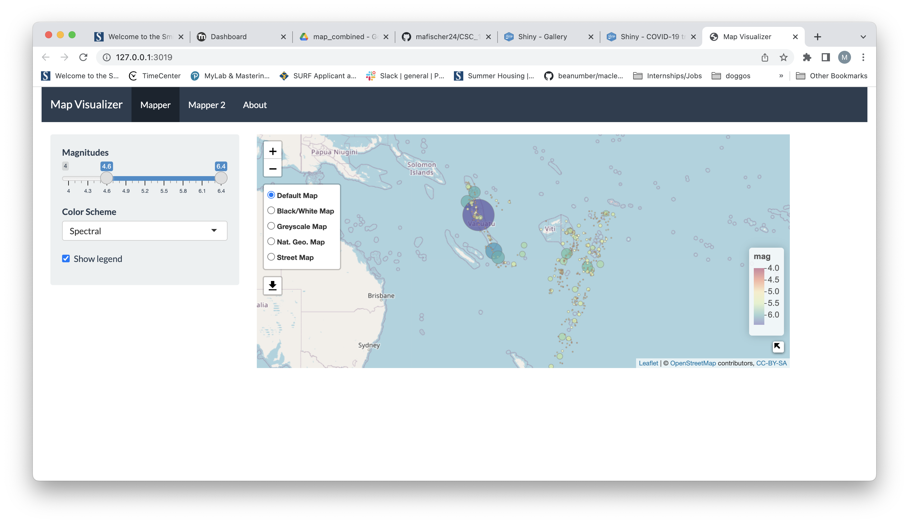
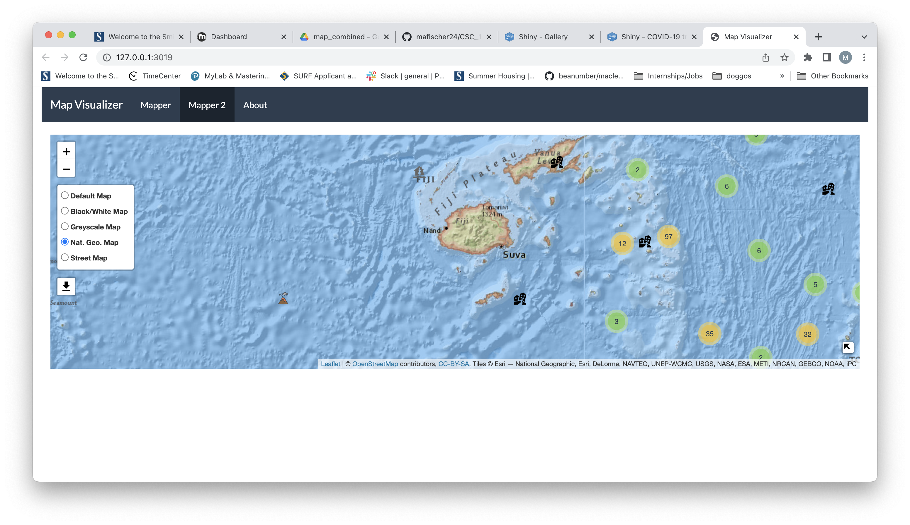

```{r setup, include=FALSE}
knitr::opts_chunk$set(echo = TRUE)
```




## Introduction

Welcome to our Map Visualizer! Our web app is designed to introduce users to `leaflet` and `shiny` in R. Our target audience is Smith College students; however, because the code for our app is available on GitHub, the scope of our audience may be a lot wider. Maps are fun, interactive visualizations that simplify complex concepts, provide context in a geographic setting, visualize where places are, and give instructions for navigation ^[https://www.mapshop.com/10-reasons-why-maps-are-important/]. We hope to educate and empower the user by providing them to explore some of the features that leaflet has to offer. There are two maps with two different sets of features for the user to explore. The data-set we used is `quakes`. Below is a preview of the first ten rows of the data-set.

```{r, echo = FALSE}
quakes[1:10, ]
```

Both maps have the following features: 

* 5 base maps.
* A mini window of the world map, with a 'minimize' button.


Here is a table of the features unique to each map:

Mapper | Mapper 2                   
----------------------------------- | ------------------------------------------------
1. Sliding bar to filter magnitude. | 1. The data points are "clustered" by proximity.
2. Drop-down menu to select a color palette for the data-points. | 2. Custom markers for each data point based on a range of magnitudes. 
3. A legend for the colors and a Show/Hide button. | 


## Instructions

Our web app has been posted to the R Shiny server, so for the user's (your) convenience, all you have to do is click on [this link to open it.](https://vhcji4-phaidra-martin.shinyapps.io/mapper/)

### Libraries

We used `leaflet` to generate the maps, get the `quake` data, and implement some fun features. We used `jsfile` to create the export buttons. 

### Packages

We used `RColorBrewer` to get the various color palettes. We used `shinythemes` to adjust the overall appearance of the web app. We used `htmlwidgets` to create the buttons for exporting. We used `testthat` to test if our app connects to the R Shiny server.


## Future Addtions 

If we had time to work on our R Shiny web app, we would include or improve the following things:

1.  Allow the user to import a data-set of their choosing and explore the data through all of Shiny's wonderful features. 
    + Example of this [here.](https://matepocs.shinyapps.io/data_analyser/)
2. Use CSS resize function to adjust the dimensions of the maps, particularly Mapper 2.
3. Add a side-panel or legend for Mapper 2 that indicates the range of magnitudes for each custom icon. Or, alternatively, adjust the size of the icons based on the range of magnitudes. 
    + See `earthquakeIcons` in `app_export.R` for magnitude ranges.
4. A way for users to choose their own custom icons. 

