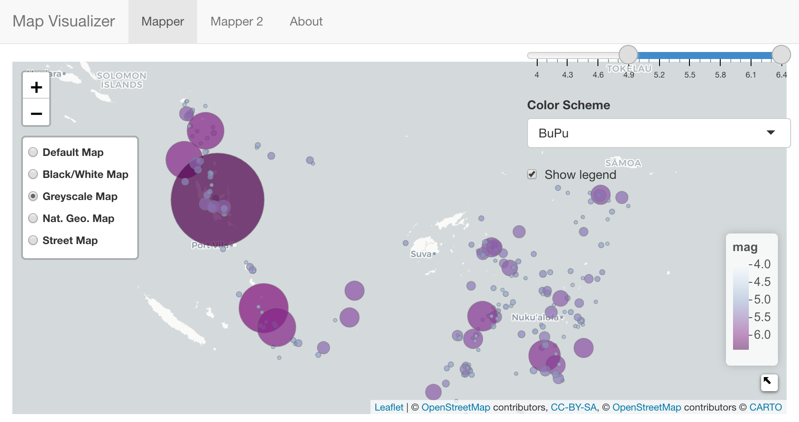
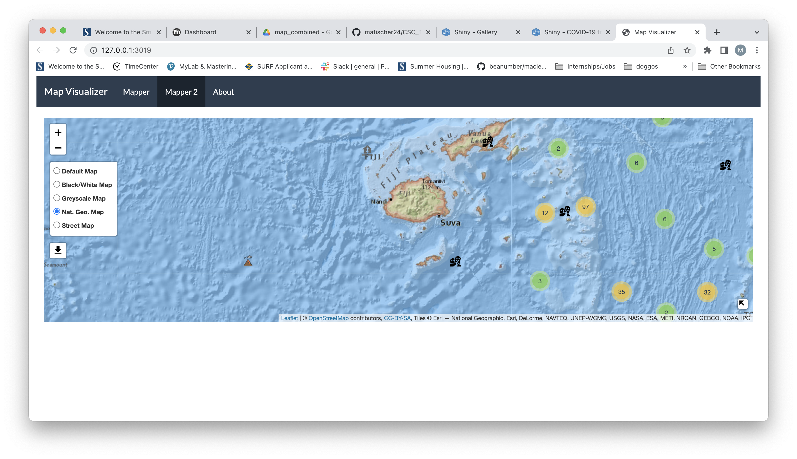

Welcome to the Map Visualizer! (pun?)
================
Fish and Phaidra
4/19/2022

## Introduction

Welcome to our Map Visualizer! Our web app is designed to introduce
users to leaflet and shiny in R. Our target audience is Smith College
students; however, because the code for our app is available on GitHub,
the scope of our audience may be a lot wider.  
Maps are fun, interactive visualizations that simplify complex concepts,
provide context in a geographic setting, visualize where places are, and
give instructions for navigation [1]. We hope to educate and empower the
user by providing them to explore some of the features that leaflet has
to offer.  
There are two maps with two different sets of features for the user to
explore. The data-set we used is quakes. Below is a preview of the first
ten rows of the data-set.

    ##       lat   long depth mag stations
    ## 1  -20.42 181.62   562 4.8       41
    ## 2  -20.62 181.03   650 4.2       15
    ## 3  -26.00 184.10    42 5.4       43
    ## 4  -17.97 181.66   626 4.1       19
    ## 5  -20.42 181.96   649 4.0       11
    ## 6  -19.68 184.31   195 4.0       12
    ## 7  -11.70 166.10    82 4.8       43
    ## 8  -28.11 181.93   194 4.4       15
    ## 9  -28.74 181.74   211 4.7       35
    ## 10 -17.47 179.59   622 4.3       19

Both maps have the following features:

-   5 base maps.
-   A mini window of the world map, with a ‘minimize’ button.

Here is a table of the features unique to each map:

| Mapper                                                            | Mapper 2                                                               |
|-------------------------------------------------------------------|------------------------------------------------------------------------|
| 1\. Sliding bar to filter magnitude.                              | 1\. The data points are “clustered” by proximity.                      |
| 2\. Drop-down menu to select a color palette for the data-points. | 2\. Custom markers for each data point based on a range of magnitudes. |
| 3\. A legend for the colors and a Show/Hide button.               |                                                                        |

## Instructions

[1] <https://www.mapshop.com/10-reasons-why-maps-are-important/>
